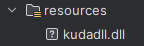

# kuda
The gpu library (wrapping cuda) written by Kotlin

[](https://jitpack.io/#volta2030/kuda)
[](https://jitpack.io/#volta2030/kuda)


## How to use? (Please Check Latest Version)

### 0. Install JDK(17) & CUDA Toolkit (12.2)

### 1. Add library in build.gradle.kts
```kotlin
repositories {
    maven{
        url = uri("https://jitpack.io")
    }
}

dependencies {
    implementation ("com.github.kudakit:kuda-12.2:1.0.9")
}

```

### 2. add vm options

```kotlin
-Djava.library.path=./src/main/resources
```

### 3. add dll files into /src/main/resources



## Support OS
Windows

## JDK Version
17

## CUDA Version
12.2

